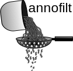
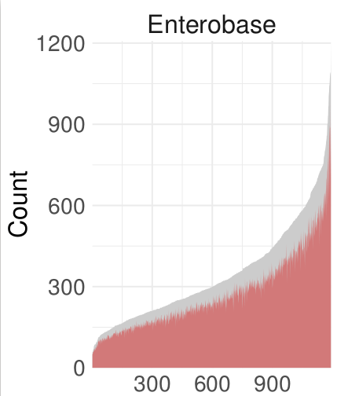

[](https://travis-ci.org/nickp60/annofilt)[](https://coveralls.io/github/nickp60/annofilt?branch=master)


# The Problem
Pangenomes from genome assemblies can be befuddled by missassemblies of genes, expecially those truncated by contig breaks.

# The Solution
`annofilt` is used to filter annotations that appear to be truncated, based on BLAST comparison with a pangenome generated from closed genomes.  Briefly, the algorithm proceeds as follows:


```
for gene in assembly:
   blast against pangenome database
   if no hits
     if stringent:
	   reject
     else:
	   retain
   else if hit passes thresholds set by user:
     retain
   else:
     reject
create filtered .gbk file
create filtered .gff file
```


# Building a reference pangenome of trusted genes
To verify the length of annotated genes, we compare annotation length, alignement coverage, and evalue to a pangenme built of well-currated annotations for a given strain.  To build a pangenome for your strain of interest, do the following:

1. Download as many complete genomes (in gff format) from RefSeq as desired (minimum of 10?, maybe?)
2. Run Roary.  This is a good time to explore their stringincy options for percentage identity (which defaults to 95%)
3. Move the `pan_genome_reference.fa` file to a convenient location for use with annofilt.  This contains a representative nucleotide sequences for each gene in the core.

# Running
`annofilt` has three modes:
1. *Normal* (fastest) - check annotations at the beginning and end of contigs
2. *--local_quick* (medium) - use Prokka's protein multifasta  of all genes when blasting; saves the step of writing the genes to disk, but jobs cant be distributed
3. *--full* (slowest) - genes are blasted individually; this gives more control with job hanndling (future versions will hopefully work with SGE, slurm, etc.)

# Quick Start

[Test data can be downloaded here](https://zenodo.org/record/1196324/files/annofilt_test_data_archive.tar.gz)

The test data contains a pangenome of 11 *E. coli* genomes, as well as a complete genome annotated with Prokka, and a toy genome assembly also annotated with Prokka.  To run `annofilt` with the test data, run the following command:

```
annofilt annofilt_test_data_archive/11complete_colis/pan_genome_reference.fa ./annofilt_test_data_archive/assembly_sample/ -o outdir -v 1
```

# Results files
- `all_loci.txt`, `good_loci.txt`, `bad_loci.txt` - these are newline-delimited files containing all locus tags, those passing the user thresholds, and those failing to pass the thresholds, respectively
- `nohit_loci.txt` - this newline-delimited file contains genes that failed to get any blast hits, indicating they are not in the core genome
- `blast_cmds` - text file contatining BLAST commands used
- `merged_results.tab` - tab-delimitted file containing all blast results before filtering
- `filtered_hits.csv` - comma-delimitted file containing all blast results after filtering
- `*x*.gbk` - GenBank file containing annotations for genes passing thresholds
- `*x*.gff` - gff3 file containing annotations for genes passing thresholds, for use with Roary


# So what does it do to my assemblies?
I used a subset of the Enterobase E coli collection, where I downloaded a representative from each Ackman sequence types (~1100 strains).

By default, annofilt checks the annotations at the end of each contig. The figure below shows the number of genes searched (2 * number of contigs) in gray, and the number of genes retained is in red.




Here we show the percentage of the searched genes that annofilt retains:


At a more granular scale, here are two instances in mauive alignmens where genes were removed because their identities were ambiguous.  We aligned 3 reference genomes to both the filtered and the unfiltered assemblies for the isolate we're interested in.


See how the genome on top has a large gene where the gene at the end of the contig on bottom is truncated?  The 4th genome (the annofilt one) shows that this partial gene annotation has been removed.

Heres another one:

There is poor homology in that neon green area; the top genome has a syntenous region, but the gene at the end of the contig appears to be truncated.

Overall, in the pangenome we generated with and without annofilt, we reduced the cloud genes by ~5000, and increased the core genome by 70 genes.


(This comparison also included ~150 of strains of interest to our group)
